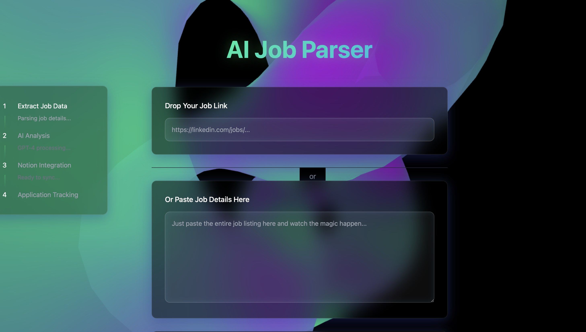
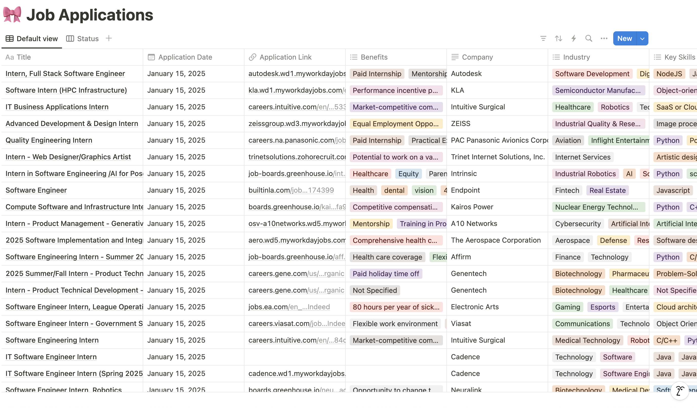
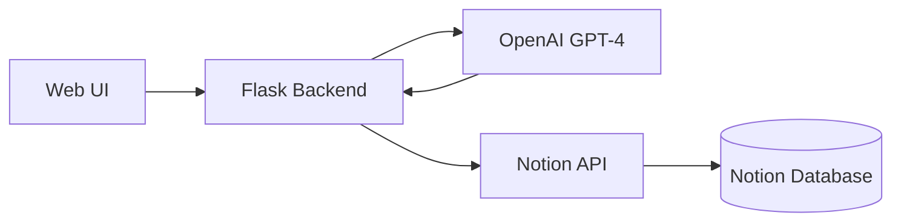

# 🚀 AI Job Application Tracker

<div align="center">


An intelligent job application tracking system that uses AI to parse job postings and automatically organize them in Notion.

[Features](#✨-features) • [Installation](#🛠️-installation) • [Usage](#💡-usage) • [Configuration](#⚙️-configuration) • [Contributing](#🤝-contributing)


</div>

## ✨ Features

- 🤖 **AI-Powered Parsing**: Automatically extracts key information from job postings using GPT-4
- 📝 **Multiple Input Methods**: 
  - URL parsing (LinkedIn, Greenhouse, Workday)
  - Direct text input
  - PDF upload
- 🔄 **Notion Integration**: Seamlessly syncs job applications to your Notion workspace
- 🎨 **Modern UI**: Beautiful glass-morphism design with interactive 3D background
- 🔍 **Smart Extraction**: Identifies key skills, requirements, and benefits
- 📱 **Responsive Design**: Works on desktop and mobile devices

## 🛠️ Installation

1. **Clone the repository**

```bash
git clone https://github.com/your-username/ai-job-application-tracker.git
cd ai-job-application-tracker
```

2. **Create a virtual environment**

```bash
python -m venv venv
source venv/bin/activate
```

3. **Install dependencies**

```bash
pip install -r requirements.txt
```

4. **Run the application**

```bash
python app.py
```

5. **Access the application**

Open your browser and navigate to `http://localhost:5000`.

2. **Access the web interface**
- Open `http://localhost:5000` in your browser
- Choose your input method:
  - Paste a job URL
  - Upload a PDF
  - Paste job description text

3. **View in Notion**
- Check your Notion database for the parsed job entry
- All information is automatically organized and categorized

## ⚙️ Configuration

### Required API Keys

- **OpenAI API Key**: For AI-powered parsing
- **Notion API Key**: For database integration
- **Notion Database ID**: Your job applications database

### Notion Database Setup

1. Create a new Notion integration
2. Share your database with the integration
3. Run the verification script:

```bash
python verify_database_access.py
```

## 🎯 Supported Job Boards

- LinkedIn
- Greenhouse
- Workday
- Indeed
- General PDF formats
- Direct text input

## 🖼️ Screenshots

<div align="center">


</div>

## 🏗️ Architecture



## 🤝 Contributing

Contributions are welcome! Please feel free to submit a Pull Request.

1. Fork the repository
2. Create your feature branch
3. Commit your changes
4. Push to the branch
5. Open a Pull Request

## 📄 License

This project is licensed under the MIT License - see the [LICENSE](LICENSE) file for details.

## 🙏 Acknowledgments

- OpenAI for GPT-4 API
- Notion for their excellent API
- Three.js for 3D background effects
- All contributors and users

---

<div align="center">
Made with ❤️ by Anus

⭐ Star this repo if you find it helpful!
</div>

